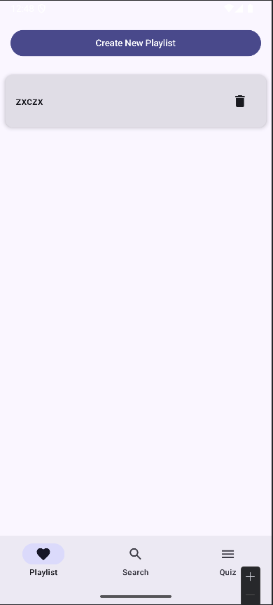

# Meezer App Technical Report

## App Summary

The Meezer app is a music search and playlist management application that enhances user interaction with Deezer's extensive music library. Users can search for songs and albums, view detailed track information, and manage playlists seamlessly through an intuitive interface.

## Key Features

- **Search Functionality**: Users can easily search for tracks and albums via a search bar, making it simple to find desired music.
- **Track Details**: The app provides comprehensive information about each track, including album artwork, artist details, and album information.
- **Playlist Management**: Users can create and manage playlists by adding or removing tracks as needed.
- **Playback**: The app allows users to play previews of tracks directly within the application.

## Screenshots

## App Architecture

The architecture of the Meezer app is designed to promote scalability, maintainability, and testability, adhering to best practices outlined in the Android documentation. By implementing a **Model-View-ViewModel (MVVM)** pattern, we effectively separate the user interface from the business logic. This separation of concerns ensures that our UI components remain lightweight and focused solely on rendering data and handling user interactions, while the ViewModels manage the application state and business logic. This approach aligns with the principles described in the [Android architecture guidelines](https://developer.android.com/topic/architecture), which emphasize minimizing dependencies on UI components and managing data through persistent models to enhance robustness and testability.

To further streamline our architecture, we utilized **Hilt** for dependency injection. Hilt simplifies the management of dependencies across various components of the app, allowing for cleaner code and easier testing. By defining clear boundaries between different parts of the application, we ensure that each component has a specific responsibility, which is crucial for maintaining a clean architecture.

Our app leverages **Room** for local data storage, providing an efficient abstraction layer over SQLite. Room facilitates seamless database interactions by allowing us to define data entities as Kotlin classes while automatically handling CRUD operations. This ensures that data remains accessible even when the app is not running. Coupled with **Retrofit** for network calls to the Deezer API, this architecture supports a seamless user experience by efficiently handling data retrieval and storage. The integration with the Deezer API enables users to access a vast library of music tracks and albums, enriching their experience within the app.

Incorporating both **Jetpack Compose** and **RecyclerView** into our UI design allows us to utilize modern declarative programming alongside traditional UI components. Jetpack Compose enhances readability and maintainability of our UI code by allowing developers to build UI components in a more intuitive manner. Meanwhile, RecyclerView is specifically used in sections where dynamic lists are necessary, such as displaying search results or playlists. This combination demonstrates versatility in our implementation choices while ensuring optimal performance.

Additionally, we effectively used **Fragments** throughout the app to encapsulate UI components logically. Fragments allow us to create modular UI sections that can be reused across different parts of the application. The integration of Jetpack components with Fragments enhances navigation capabilities within the app. We employed **Navigation Compose** in certain areas to facilitate smooth transitions between different screens while maintaining a clean navigation stack.

For more detailed insights into recommended app architectures and best practices, we referred to resources such as the official [Android architecture documentation](https://developer.android.com/topic/architecture) and [GitHub's architecture templates](https://github.com/android/architecture-templates). These resources have been instrumental in guiding our architectural decisions throughout the development process.

### Implementation Choices

- **MVVM Pattern**: The app uses the Model-View-ViewModel (MVVM) pattern to separate UI logic from business logic. This helps in maintaining a clean architecture and makes the app easier to test.
  
- **Hilt for Dependency Injection**: Hilt is used for dependency injection, which simplifies the process of providing dependencies and improves the testability of the app.

- **Jetpack Compose and RecyclerView**: The UI is built using a combination of Jetpack Compose and RecyclerView. Jetpack Compose allows for a declarative approach to building UI components, making the UI code more readable and easier to maintain. RecyclerView is specifically utilized in areas where dynamic lists are required, such as displaying search results or managing playlists.

- **Room Database**: Room is used for local data storage, providing an abstraction layer over SQLite. This helps in managing the app's data more efficiently by allowing straightforward database queries through DAO (Data Access Object) interfaces.

- **Retrofit for Network Calls**: Retrofit is used for making network calls to the Deezer API. It simplifies the process of making HTTP requests and handling responses while ensuring efficient data retrieval from external sources.

## Key Components

- **ViewModel**: Manages UI-related data and handles business logic. Examples include `SearchViewModel` and `PlaylistViewModel`.

- **Repository**: Acts as a single source of truth for data. It abstracts various data sources (local database via Room and remote API via Retrofit) while providing a clean API for data access.

- **UI Components**: Built using a combination of Jetpack Compose and RecyclerView, these components render the user interface and interact with the ViewModel. Notable examples include `SearchScreen` (using Jetpack Compose) for searching music tracks and `PlaylistScreen` (using RecyclerView) for displaying playlists.

This structured approach ensures that the Meezer app not only provides a rich user experience but also maintains a robust architecture that can evolve with future enhancements. By integrating modern Android development practices with established patterns like MVVM, Room, Retrofit, Jetpack Compose, RecyclerView, Fragments, and Navigation Compose, we have created an application that is both powerful and user-friendly.

## Peer Contributions
The development of the Meezer app was a collaborative effort between two classmates, each contributing equally to the project.We worked with a strong collaborative alignment, holding regular meetings to discuss progress, share ideas, and address challenges.Helped us to split tasks between 2 peers. Both team members played a crucial role in designing the architecture, implementing features, and ensuring a seamless user experience. Together, we integrated various technologies such as Room, Retrofit, Jetpack Compose, and RecyclerView, and worked on the overall UI design and functionality. This teamwork not only enhanced our learning experience but also resulted in a well-rounded application that showcases our combined skills and dedication to the project.
